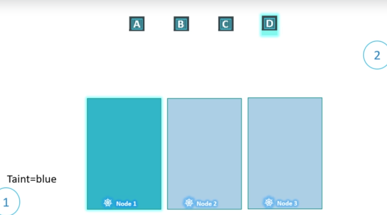
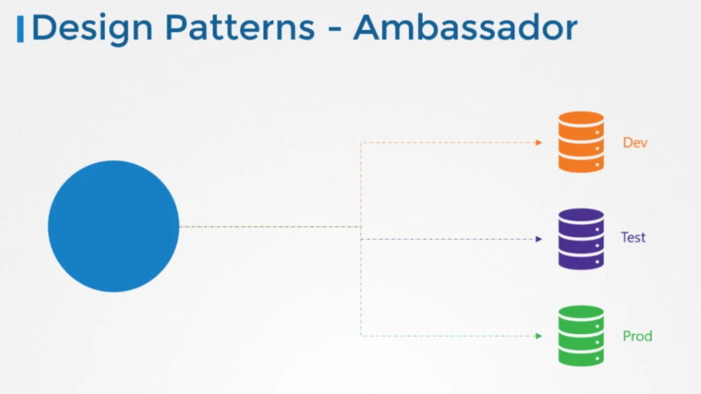

# Certified Kubernetes Application Developer-CKAD

## Exam Brief

- Duration : 2 hours
- Performance-Based Exam
- Certification validity: 3 years
- Prerequisite: None
- Cost: $395 USD, 1 year exam eligibility, with a free retake within the year.
- [Official CKAD curriculum](https://github.com/cncf/curriculum/blob/master/CKAD_Curriculum_v1.24.pdf)
  
### Useful keys & Common accronyms in Kubernetes

- K8s = Kubernetes
- CNCF = Cloud Native Computing Foundation
- NetPol = Network Policies
- PV = Persistent Volumes
- PVC = Persistent Volume Claims
- CSI = Container Storage Interface
- CNI = Container Network Interface
- CI/CD = Continuous Integration & Continuous Deployment
- RBAC = Role Based Access Control
- OCI = Open Container Initiative
- CRI = Container Runtime Interface
- SMI = Service Mesh Interface
- SLO = Service Level Objectives
- SLI = Service Level Indicators
- SLA = Service Level Agreements

## 0. Commands

### get

 ```bash
kubectl get <resource>
```

It give us all the resources of the specificated kind. More info with -o wide

### run

 ```bash
kubectl run <resource>
```

It creates a resource, use  ```-o yaml --dry-run=client` for showing the yaml that creates the resource.

### describe

 ```bash
kubectl describe  <resource> <name>
```

It shows all the info about the resource. We can see there the state of the containers in the pods, also some events.

### delete

 ```bash
kubectl delete  <resource> <name>
```

It deletes the resouce, if a namespce is deleted, all resources in the ns are deleted too.

### create

 ```bash
kubectl create -f <file>
```

Allows us to create a resource defined in a file.

### edit

We can edit a resource by editing the the file an then using:

 ```bash
kubectl apply -f <file>
```

or just editing the resource by:

 ```bash
kubectl edit <resource> <name>
```

### expose

We can expose a resouce by creating a clusterIp:

 ```bash
kubectl expose <resource> <name> --name <name-clusterIP> --port <port> -f <file>
```

## 1. Core concepts

### 1.2 Architecture

A cluster is formed by different nodes, where pods are deployed. The whole cluster
is managed by the master.

Kubernetes is composed by:

- API server: It is the component that allows us to comunicate with our cluster
- etcd: It is a key-value distributed store, it sotores data to manage our cluster
- kubelet: agent that runs on each node
- comtainer runtime: software to run containers
- controller: it orchestrait the cluster. If a node falls this component manage the situation
- scheduler: It asigns tasks to nodes

Pods and services only runs on workers, teh master nodes only manage the cluster and had the API server.

Our client aplication is kubectl, it allows us to interact with our cluster.

#### Files

The files has 4 root level atributes:

- ApiVersion: version of kubernetes
- kind: kind of resource which is described by the file (pod,service,etc.)
- metadata: data about the object (labels, name, namespace). Labels are a dictonary key-value, anything could be set as key or value.
- spec: Describing the resource, each resource has his own spec. For example a pod is described by its images and names of the containers.
For creating a resouce using a file use

 ```bash
kubectl create -f file.yaml
```

#### Pods

Pods are the smallest deployable units of computing that you can create and manage in Kubernetes.
We can create one by the command

```bash
kubectl run ngix --image nginx
```

Primero se especifica el nombre y tras eso lam imagen que se quiera usar.

- [Pods in Kubernetes](https://kubernetes.io/docs/concepts/workloads/pods/)

#### Replica set
It is a controller which helpls us to have multiple instnaces of the same pod.


## 2. Configs
#### ConfigMaps
It allows us to create  a key-value map, where we can store different configuration info. Later we can use it for assinging values at enviroment variables in pods. [Documentation](https://kubernetes.io/docs/concepts/configuration/configmap/)
We can create a config map by the command
```bash
kubectl create ConfigMap <name> --from-literal <key>=<value>
```

Another option is creating it by a file:
```bash 
apiVersion: v1
kind: ConfigMap
metadata:
  name: game-demo
data:
  # property-like keys; each key maps to a simple value
  player_initial_lives: "3"
```
For using these values in another resource we must assign it like this:
```bash 
envFrom:
  - configMapRef:
      name: app-config
      key: APP_COLOR
```

or 

```bash 
env:
  - name: APP_COLOR
    valueFrom:
      configMapRef:
        name: app-config
        key: APP_COLOR
```

The first name is for the enviroment variable of the pod, after that we select choosing the value from the ConfigMap by the name and the key.

#### ConfigMaps 
Secrets have the same porpouse as ConfigMaps, however are more secure. We can define it in the same way as configMaps:
```bash
kubectl create secret generic <name> --from-literal <key>=<value>
```
There are several secret types, that we can see on the [Documentation](https://kubernetes.io/docs/concepts/configuration/secret/).
We can use only one key for a pod or use the whole secret:
```bash 
envFrom:
  - secretRef:
      name: app-config
```

#### Security context
Security  define the priviledge of the resource (user, SELonux, capabilites, etc.). More info in the [documentation](https://kubernetes.io/docs/tasks/configure-pod-container/security-context/). For establish a policy we can do it on files such as:

```bash 
apiVersion: v1
kind: Pod
metadata:
  labels:
    run: ubuntu-sleeper
  name: ubuntu-sleeper
spec:
  securityContext:
    runAsUser: 1010
  containers:
  - image: ubuntu
    name: ubuntu-sleeper
    command: ["sleep", "5000"]
    securityContext:
      capabilities:
        add: ["SYS_TIME"]
```
Capabilities can be only defined a container level, while user can be establish at pod level.
#### Service account
It provides acces to use the kubernetes API to different programs. Each service account has
a token, stored as secret, which gives the acces to the API They can be deployed outside the
cluster so we must give them the token manualy, for accesing it we can use:
```bash
kubectl describe serviceaccount <name>
kubectl describe secret <token-name>
```
When a pod is created a service account is mounted, we can see it if we describe the pod.
For services within the cluster we can mount our service account to our resources so  we
dont need to specify it later manually. We cant change the service account mounted on a pod,
inthat case we must delete and recreate the pod, however a Deployment will manage the situation
deleting his pods for changing the serviceaccount.

```bash 
apiVersion: v1
kind: Pod
metadata:
  labels:
    run: ubuntu-sleeper
  name: ubuntu-sleeper
spec: 
  containers:
  - image: ubuntu
    name: ubuntu-sleeper
    command: ["sleep", "5000"]
  serviceAccountName: <name>
```
#### Resource limits
Each node has different resource limits (Ram, Cpu, Storage, etc). The scheduler will assign pods into
nodes whith availabilty (if a pod need 50Mb Ram but there are only 10 Mb available, the pod will be 
located into another node). If there is no node available the pod will be set with state pending. 
By default kubernetes consider 0.5 CPU, 256 Mi per pod. This is known as resouce request, the 
minimun resources request by a pod. The unit of the CPU dependes of the provider. 
We can modify the defaul value adding a field resources on the definition of the pod:

```bash 
apiVersion: v1
kind: Pod
metadata:
  labels:
    run: ubuntu-sleeper
  name: ubuntu-sleeper
spec: 
  containers:
  - image: ubuntu
    name: ubuntu-sleeper
    command: ["sleep", "5000"]
    resource:
      request:
        memory: "1Gi"
        cpu: 1
```
In Kubernetes two different units can be specify, 1 G meaning one gigabyte and 1 Gi meaning one Gibibyte

Another interesting resouce field is limits. It specify the limits of containers within the pod:

```bash 
apiVersion: v1
kind: Pod
metadata:
  labels:
    run: ubuntu-sleeper
  name: ubuntu-sleeper
spec:
  containers:
  - image: ubuntu
    name: ubuntu-sleeper
    command: ["sleep", "5000"]
    resource:
      request:
        memory: "1Gi"
        cpu: 1
      limits:
        memory: "1Gi"
        cpu: 1
```
A container can't use more CPU  that the specified, however the container can use more memory
than its limit, if it does constantly, the pod will be terminated.

#### Taints and tolerations
Them are used to set restrictions on what pods can be scheduled on a pod.
If there is no traint the schedulded would balance the pods across all the cluster.

This configuration is useful when we have a node with resource for a especific activity 
such as GPU por ML. If a taint is assigned to a node, the pods without a toleration for 
taint can't be placed on that node.


For assinging taints we can use the comand
```bash
kubectl taint nodes <node-name> key=value:taint-effect
```

If the pod don't tolerate a taint it will suffer a effect, there are three effects:
 - **NoSchedule**: The pod will no be scheduled on that nod.
 - **PreferNoSchedule**: The scheduler will try to not scheduled the pod on that node but
 it is not guaranteed.
 - **NoExecute**: New pods will no be scheduled on that node and existing pods will 
 be terminated.

To assign a toleration we must add a section to the specification of the pod:
```bash 
apiVersion: v1
kind: Pod
metadata:
  labels:
    run: ubuntu-sleeper
  name: ubuntu-sleeper
spec:
  containers:
  - image: ubuntu
    name: ubuntu-sleeper
    command: ["sleep", "5000"]
  toleration:
  - key: "<key>"
    opertor: "Equal"
    value: "<value>"
    effect: "<taint-effect>"
```

Toleration do not tells the pod to go to a particular node, it restricts which pods can be 
placed on it, for instance if we have a toleration to blue the pod can be scheduled on a node 
with blue taint or without taints.

For deleting a taint use the following command:
```bash
kubectl taint nodes <node-name> key=value:taint-effect-
```

#### Node Selector
Simple method which allows us to limit pods to run on specifics nodes. For doing it we use labels:
```bash
k label node <node> <key>=<value>
```
After that we use the field ```nodeSelector```:


```bash 
apiVersion: v1
kind: Pod
metadata:
  name: ubuntu-sleeper
spec:
  containers:
  - image: ubuntu
    name: ubuntu-sleeper
  nodeSelector:
    <key>=<value>
```
It is really simple, so node afinity allows us to elaborate more complex solutions.

#### Node afinity
It allows us to use advance option to limit pod placement on nodes. It has a lot of nested keys for 
configuring the affitny such as: 
```bash
affinity:
        nodeAffinity:
          requiredDuringSchedulingIgnoredDuringExecution:
            nodeSelectorTerms:
                 -  matchExpressions:
```
Here we can use the keys `key`,`operator` and `values` for selecting a list of labels.
    - **key**: refers the labbel key.
    - **Operator**: There are several options which are self described:
        - In
        - NotIn
        - Exists: simple check if the label key exist, does not require a value
        - DoesNotExists: simple check if the label key does not exist, does not require a value
        - Gt
        - Lt
```bash
-  matchExpressions:
                    -  key: color
                       operator: In
                       values:
                        - blue
```
The type of the node affinty defines de behaviour of the affinty, there are two types:
    - requiredDuringSchedulingIgnoredDuringExecution
    - preferredDuringSchedulingIgnoredDuringExecution
    - requiredDuringSchedulingRequiredDuringExecution (not currently available)
    
If a affinty is required and no node has the label, the pod will be not scheduled.

## 3 Multi-containers Pods
All the containers on the same pod has access among them using localhost address, so it is not 
using a kubernetes service for contect them
### Ambassador
This container behaves as a proxy for applications such as data bases. If we had an application which
stores information on a database depending of the stage of development (test, dev,production). We 
should abstract that logic of selecting database of the app pod and create one for doing that. 
The application pod would connect to localhost and the *Ambassador* will select the correct database.

### Adapter
An adapter container is used for formatting logs from different containers for processing the logs 
before sending them to a log central server. The idea is to manage the logs and send all of them with 
the same format, does not matter from which container or application they were prodeced.
### Sidecar
The sidecar pattern uses a container in the same pod as an application container for gathering logs 
and sending them to a central log server.
